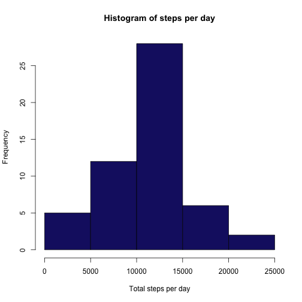
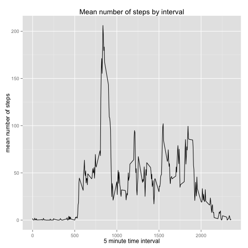
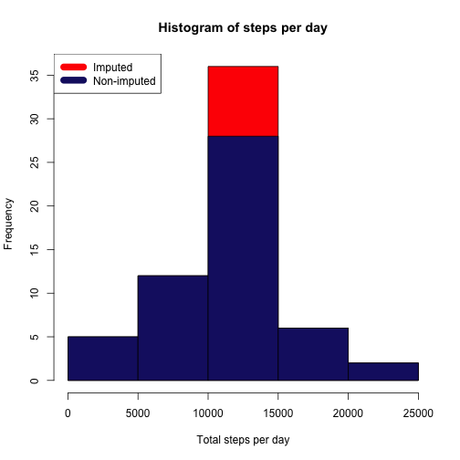
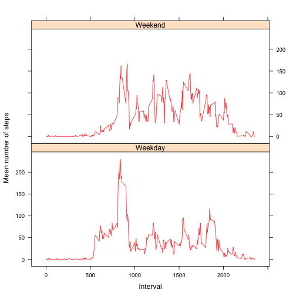

## About
The purpose of this assignment is to use concepts learned in week 1 and 2 of "Reproducible Reseach" to create a markdown file. The data used for this assignment is from a personal activity monitoring device. This device collects data at 5 minute intervals through out the day. The data consists of two months of data from an anonymous individual collected during the months of October and November, 2012 and include the number of steps taken in 5 minute intervals each day. 

The markdown file will include code to complete the following steps and answer the following questions;

* Load and preprocess the data
* What is the mean number of steps per day?
* What is the average daily activity pattern?
* Imput missing values
* Are there differences in activity patterns between weekdays and weekends?


## Load and preprocess the data
The following code will check to see if the data file exists in the working directory. If it does not exist it will be downloaded from the URL and read into r using `read.csv()` resulting in the dataframe `activitydata`

1. Load the data

```r
if(!file.exists("activity.csv")) {
        temp <- tempfile()
        download.file("http://d396qusza40orc.cloudfront.net/repdata%2Fdata%2Factivity.zip", temp)
        unzip(temp)
        unlink(temp)
}
       
activitydata <- read.csv("activity.csv")
```

##  What is the mean number of steps per day?

1. Calculate the total number of steps taken per day and save it to the `totalStepsByDay` variable

```r
totalStepsByDay <- aggregate(steps ~ date, activitydata, sum)
```

2. Create a histogram of the total number of steps taken each day

```r
hist(totalStepsByDay$steps, xlab = "Total steps per day", main = "Histogram of steps per day", col = "midnightblue")
```

 

3. Calculate and report the mean and median of the total number of steps taken per day

```r
stepmean <- mean(totalStepsByDay$steps)
stepmedian <- median(totalStepsByDay$steps)
options(scipen=999)
```
The `mean` is 10766.1886792. 

The `median` is 10765. 

## What is the average daily activity pattern?

1. Calculate and report the mean number of steps per 5 minute interval
Make a time series plot (i.e. type = "l") of the 5-minute interval (x-axis) and the average number of steps taken, averaged across all days (y-axis)

```r
meanStepsByInterval <- aggregate(steps ~ interval, activitydata, mean)
library(ggplot2)
qplot(meanStepsByInterval$interval, meanStepsByInterval$steps, meanStepByInterval, geom = "line", xlab = "5 minute time interval", ylab = "mean number of steps", main = "Mean number of steps by interval")
```

 

2. Which 5-minute interval, on average across all the days in the dataset, contains the maximum number of steps?


```r
maxsteps <- meanStepsByInterval[which.max(meanStepsByInterval$steps), ]
interval <- maxsteps$interval
stepsmax <- maxsteps$steps
```
The maximum `mean` number of steps taken is 206.1698113 and occurs at the 835 time interval

## Imput missing values
Missing values for steps need to be imputed. The presence of missing days may introduce bias into some calculations or summaries of the data.

1. Calculate the number of missing values in `steps` 

```r
missingvalues <- sum(!complete.cases(activitydata$steps))
```
The number of `missingvalues` is 2304


2. Impute the missing values (`NA`) by assigning the mean value for the corresponding time interval

```r
#Read in activity data to second dataframe
activitydata2 <- read.csv("activity.csv")
#recalculate the mean steps per interval
meanStepsByIntervalImpute <- aggregate(steps ~ interval, activitydata2, mean)
#bind together the two dataframes
bindeddata <- cbind(activitydata2, meanStepsByIntervalImpute)
#subset the dataframe to remove duplicate columns
subsetbindeddata <- bindeddata[, c(1, 2, 3, 5)]
#rename columns
colnames(subsetbindeddata) <- c("steps", "date", "interval", "stepsmean")
#impute the missing data by interval using a for loop
for(i in 1:nrow(subsetbindeddata)) {
         if(is.na(subsetbindeddata$steps[i]))
                 subsetbindeddata$steps[i] <- subsetbindeddata$stepsmean[i]
 }
#subset for necessary data
imputedData <- subsetbindeddata[, 1:3]
head(imputedData)
```

```
##       steps       date interval
## 1 1.7169811 2012-10-01        0
## 2 0.3396226 2012-10-01        5
## 3 0.1320755 2012-10-01       10
## 4 0.1509434 2012-10-01       15
## 5 0.0754717 2012-10-01       20
## 6 2.0943396 2012-10-01       25
```

3. Make a histogram of the total number of steps taken each day and calculate and report the mean and median total number of steps taken per day. Do these values differ from the estimates from the first part of the assignment? What is the impact of imputing missing data on the estimates of the total daily number of steps?


```r
#Calculate the number of steps taken each day with NA's replaced with the mean for that interval
totalStepsByDayimputed <- aggregate(steps ~ date, imputedData, sum)
#Create a comparison histogram
hist(totalStepsByDayimputed$steps, xlab = "Total steps per day", main = "Histogram of steps per day", col = "red")
hist(totalStepsByDay$steps, xlab = "Total steps per day", main = "Histogram of steps per day", col = "midnightblue", add=T)
legend("topleft", c("Imputed", "Non-imputed"), col=c("red", "midnightblue"), lwd=10)
```

 

```r
#Calculate the mean and median for the imputed steps
meanimputed <- mean(totalStepsByDayimputed$steps)
medianimputed <- median(totalStepsByDayimputed$steps)
```

As you can see below the `mean` did not change once `NA's` were removed. The `median` changed slightly. 

**Imputed Data:**

Mean = 10766.1886792

Median = 10766.1886792

**Non-Imputed Data**

Mean: 10766.1886792

Median: 10765

## Are there differences in activity patterns between weekdays and weekends?

1. Create a new factor variable in the dataset with two levels – “weekday” and “weekend” indicating whether a given date is a weekday or weekend day.


```r
#change date from factor to Date
imputedData$date <- as.Date(imputedData$date, "%Y-%m-%d")
day <- weekdays(imputedData$date)
#bind imputedData and day dateframes together
imputedDataDay <- cbind(imputedData, day)

imputedDataDay$day <- as.character(imputedDataDay$day)

imputedDataDay$day <- gsub("Monday", "Weekday", imputedDataDay$day)
imputedDataDay$day <- gsub("Tuesday", "Weekday", imputedDataDay$day)
imputedDataDay$day <- gsub("Wednesday", "Weekday", imputedDataDay$day)
imputedDataDay$day <- gsub("Thursday", "Weekday", imputedDataDay$day)
imputedDataDay$day <- gsub("Friday", "Weekday", imputedDataDay$day)
imputedDataDay$day <- gsub("Saturday", "Weekend", imputedDataDay$day)
imputedDataDay$day <- gsub("Sunday", "Weekend", imputedDataDay$day)

imputedDataDay$day <- as.factor(imputedDataDay$day)
```

2. Make a panel plot containing a time series plot (i.e. type = "l") of the 5-minute interval (x-axis) and the average number of steps taken, averaged across all weekday days or weekend days (y-axis).


```r
# load the lattice package
library(lattice)

#summarize the number of steps by interval by weekend and weekday
daytypesteps <- aggregate(steps ~ interval + day, data = imputedDataDay, mean)

#create a xyplot
xyplot(steps ~ interval | day, daytypesteps, type = "l", layout = c(1, 2), 
    xlab = "Interval", ylab = "Mean number of steps", col = "red")
```

 
